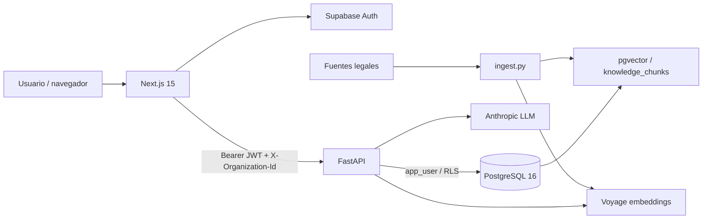

# Arquitectura actual y arquitectura objetivo

## Arquitectura implementada

## Stack observado en código

| Capa | Implementación actual |
|---|---|
| Frontend | Next.js 15 + React 18 + TypeScript + Tailwind |
| Backend | Python 3.12 + FastAPI + SQLAlchemy 2 + Alembic + Pydantic v2 |
| DB | PostgreSQL 16 + pgvector |
| Auth | Supabase Auth |
| LLM | interfaz `LLMClient`; adaptador implementado: Anthropic |
| Embeddings | interfaz `EmbeddingClient`; adaptador implementado: Voyage |
| RAG | `knowledge_chunks` + pgvector |
| CI | GitHub Actions |
| Contenedores | Docker Compose + Dockerfile backend |

## Diferencia entre arquitectura objetivo e implementación

La especificación original menciona componentes como Redis/Celery, object storage con WORM/Object Lock, generación Word/PDF, pagos y observabilidad. **No deben describirse como implementados todavía.** Son arquitectura objetivo para módulos posteriores.

Tampoco se observa LangChain o LlamaIndex en las dependencias actuales: la integración de IA está implementada de forma directa mediante adaptadores propios.

## Fronteras importantes

### Frontend

Responsable de UI, sesión de Supabase y llamadas tipadas a la API. No debe contener reglas de autorización o scoring como fuente de verdad.

### Backend

Responsable de autenticación efectiva, permisos, validaciones, lógica de negocio, scoring, guardarraíles, RAG y persistencia.

### Base de datos

Es una segunda barrera de seguridad. El backend runtime usa un rol restringido y las políticas RLS filtran por organización.

### IA

El LLM redacta; el scoring y la clasificación base de riesgo se calculan determinísticamente. Las citas del informe se validan contra los chunks realmente recuperados.
